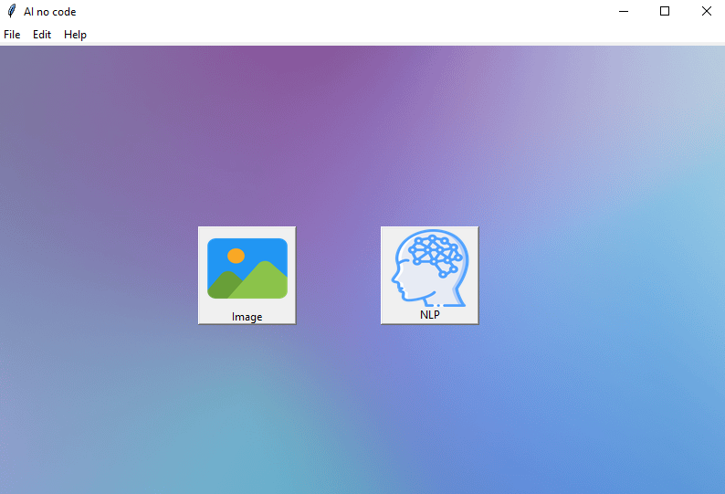
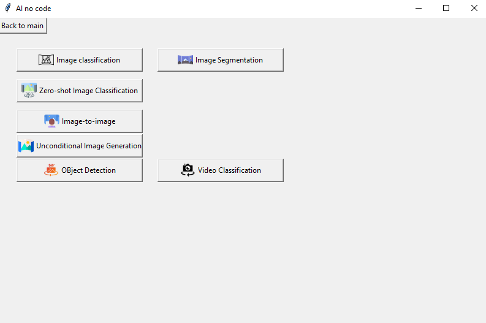

# AI No Code

This is a project called Al-No-Code based on artificial intelligence where we can see on the main screen the first two inputs IMAGE and NLP   
that each one of them leads us to the different models that we have to use



They show us the name of the different models that we have once we know which one we are going to use, we press according to their respective button.  
We can see a little in the following image:



We can see that it has a very simple and easy-to-use interface, and This project is still in progress,   
We are constantly improving and adding better things so that its use is better and understandable.  

```bash
This entire project is based on the Python programming language.
```
#### This entire project is based on the Python programming language. 


# Created by:

## Elva IA 

